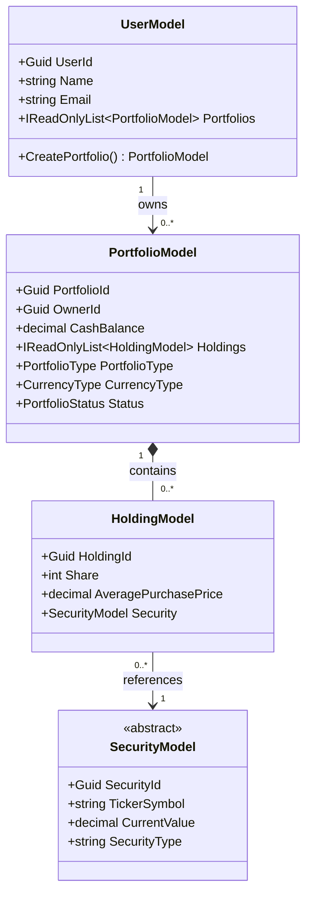

# Sep2026

```mermaid
classDiagram
    direction TB

    class UserModel {
        +Guid UserId
        +string Name
        +string Email
        +IReadOnlyList~PortfolioModel~ Portfolios
        +CreatePortfolio() PortfolioModel
    }

    class PortfolioModel {
        +Guid PortfolioId
        +Guid OwnerId
        +decimal CashBalance
        +IReadOnlyList~HoldingModel~ Holdings
        +PortfolioType PortfolioType
        +CurrencyType CurrencyType
        +PortfolioStatus Status
    }

    class HoldingModel {
        +Guid HoldingId
        +int Share
        +decimal AveragePurchasePrice
        +SecurityModel Security
    }

    class SecurityModel {
        <<abstract>>
        +Guid SecurityId
        +string TickerSymbol
        +decimal CurrentValue
        +string SecurityType
    }

    UserModel "1" --> "0..*" PortfolioModel : owns
    PortfolioModel "1" *-- "0..*" HoldingModel : contains
    HoldingModel "0..*" --> "1" SecurityModel : references
```
